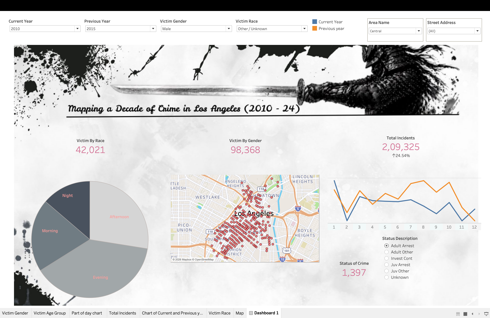

# Mapping a Decade of Crime in Los Angeles (2010–2024)

An end-to-end data engineering + analytics project that ingests, transforms, and visualizes 3.1M+ LAPD crime records through a config-driven Python pipeline and an interactive Tableau dashboard.

**Author:** Aman Kumar Bhamboo
**Version:** 1.0.0

---

## Live Dashboard

[View on Tableau Public](https://public.tableau.com/app/profile/aman.bhamboo/viz/MappingCrimeinLosAngles/Dashboard1)



---

## Overview

This project has two parts:

**1. Data Pipeline** — A config-driven Python pipeline that ingests raw CSV data from [data.gov](https://data.gov), cleans and transforms it, merges 14 years of records, and exports to PostgreSQL.

**2. Tableau Dashboard** — An interactive dashboard connected to the PostgreSQL database, enabling year-over-year crime comparisons across LA neighborhoods with filters for area, victim demographics, and crime status.

---

## Dataset

- **Source:** [Los Angeles Crime Data — data.gov (Official)](https://catalog.data.gov/dataset/crime-data-from-2010-to-2020)
- **Files:**
  - `Crime_Data_from_2010_to_2019.csv`
  - `Crime_Data_from_2020_to_2024.csv`
- **Size:** ~3.1M rows × 28 columns
- **Period:** 2010–2024

---

## Dashboard Features

- **Year-over-Year Comparison** — Compare any two years with % change KPI
- **Geographic Map** — Crime locations plotted across LA neighborhoods
- **Total Incidents KPI** — 209,325 incidents with 24.54% YoY trend indicator
- **Part of Day Breakdown** — Morning / Afternoon / Evening / Night (pie chart)
- **Monthly Trend Chart** — Current year vs previous year line chart
- **Crime Status Filter** — Adult Arrest, Juvenile, Investigation Continue, etc.
- **Filters** — Current Year, Previous Year, Victim Gender, Victim Race, Area Name, Street Address

---

## Project Structure

```
├── config/
│   ├── config.yaml              # Main pipeline configuration
│   └── rename_column.yaml       # Column rename mappings
├── data_before_anything/        # Raw input CSVs (gitignored)
├── artifacts/                   # Pipeline output (gitignored)
│   ├── merged.csv
│   └── merged_info.json
├── logs/                        # Timestamped log files (gitignored)
├── sql/                         # SQL scripts for post-export cleaning
├── src/
│   ├── components/
│   │   ├── data_ingestion.py
│   │   ├── data_transformation.py
│   │   └── data_export.py
│   ├── exceptions.py
│   └── logger.py
├── Tableau Dashboards/          # Tableau workbook files
├── main.py
├── pyproject.toml
└── uv.lock
```

---

## Pipeline Steps

### Step 1: Data Ingestion
Reads file list from `config.yaml` and resolves paths from `data_before_anything/`. Raw data stays in place — no copying.

### Step 2: Data Transformation
- Strips whitespace from column names
- Converts all columns to snake_case
- Saves individual transformed CSVs + metadata JSON if merge is disabled

### Step 3: Merge
Concatenates both DataFrames, renames columns per `rename_column.yaml`, and outputs `artifacts/merged.csv`.

### Step 4: Export to PostgreSQL
- Creates `crime_data` schema if not exists
- Exports merged dataset to `crime_data.crime_combined`
- Uses SQLAlchemy with `method='multi'` and `chunksize=1000`

### Step 5: Post-Export SQL Cleaning
Manual SQL scripts in `sql/` for null handling and value replacements.

---

## Tech Stack

| Layer | Tool |
|---|---|
| Language | Python 3.9+ |
| Package Manager | uv |
| Data Processing | pandas |
| Config | PyYAML |
| Database | PostgreSQL + SQLAlchemy + psycopg2 |
| Visualization | Tableau Public |
| Data Source | data.gov (Official US Government Data) |

---

## Running the Pipeline

### Prerequisites
- Python ≥ 3.9
- [uv](https://docs.astral.sh/uv/) package manager
- PostgreSQL running on `localhost:5432`

### Setup

```bash
uv sync
```

### Execute

```bash
uv run main.py
```

Logs written to `logs/pipeline_YYYYMMDD_HHMMSS.log`.

### Export from PostgreSQL

```bash
# Export as CSV
psql -h localhost -U apple -d lapd_crime -c "\copy crime_data.crime_combined TO '~/Desktop/crime_export.csv' CSV HEADER"

# Full DB dump
pg_dump -h localhost -U apple -d lapd_crime -F c -f ~/Desktop/db_dump.dump
```

### Run SQL Cleaning Scripts

```bash
psql -h localhost -U apple -d lapd_crime -f sql/replace_values.sql -f sql/handle_nulls.sql
```

---

## Configuration

### `config/config.yaml`

```yaml
data_ingestion:
  artifacts_folder: 'artifacts'
  raw_data_folder: 'data_before_anything'
  files_to_process:
    - Crime_Data_from_2010_to_2019.csv
    - Crime_Data_from_2020_to_2024.csv
  merge:
    enabled: true

postgres:
  host: 'localhost'
  port: 5432
  database: 'lapd_crime'
  username: 'apple'

export:
  schema: 'crime_data'
  merged_table_name: 'crime_combined'
```

---

## Performance Notes

- ~3.1M rows processed in-memory — ensure ~2–4GB RAM free
- Export takes ~3–5 minutes with `method='multi'` + `chunksize=1000`
- Switch to `method=None` for faster COPY-based export

---

## Git Ignored

- `data_before_anything/` — raw CSVs (~800MB)
- `artifacts/` — transformed output
- `logs/` — log files
- `.venv/` — virtual environment

---

## Error Handling

Custom exception hierarchy in `src/exceptions.py`:

```
USAccidentException
├── DataIngestionError
└── DataTransformationError
```
